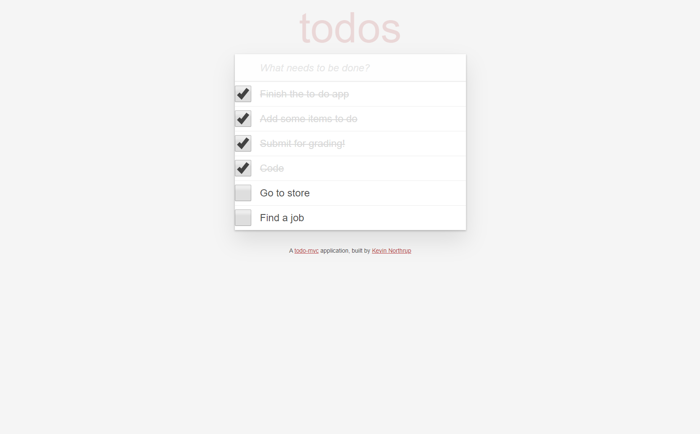

# Todo

Todo is a single page app (SPA) with a focus on jQuery for its implemenetation.  
  
[View the deployed application](https://todo-kevin-northrup.herokuapp.com/)
___

### Features:
- Built using Ruby on Rails
- TDD focused, using RSpec and FactoryBot gems
- Utilizes RESTful JSON API to fetch and update
- JavaScript and jQuery allow for dynamic udpates to the view
- Simple HTML and CSS interface for minimalistic design

___
### Screenshot:

